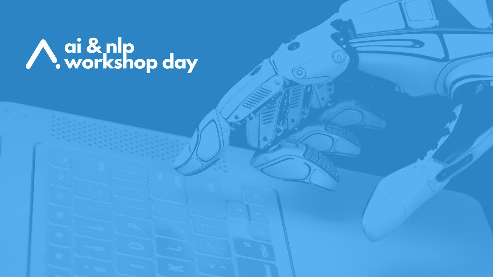

Our ULMFiT presentation at AI & NLP Day in Warsaw
=========================================================================================================================

autor: Piotr Czapla

We had a pleasure to win the first prize in Poleval 2018 for language
modeling task. This success has largely resulted from the adaptation we
did to ULMFiT architecture by Jeremy Howard and Sebastian Ruder. Below
you can find a short presentation pointing the recent changes to the
Language Modeling, especially the crucial improvement of polish language
model and n-waves contribution to this :). The paper for the conference
can be found here: <https://arxiv.org/pdf/1810.10222.pdf>

The video from the presentation will be available after the conference
and we'll happily share it then. For the time being here are the slides:

The code for poleval2018 can be found at
<https://github.com/n-waves/poleval2018>. If you wish to get the
pre-trained weights, you can fetch them from
<https://go.n-waves.com/poleval2018-modelv1>

