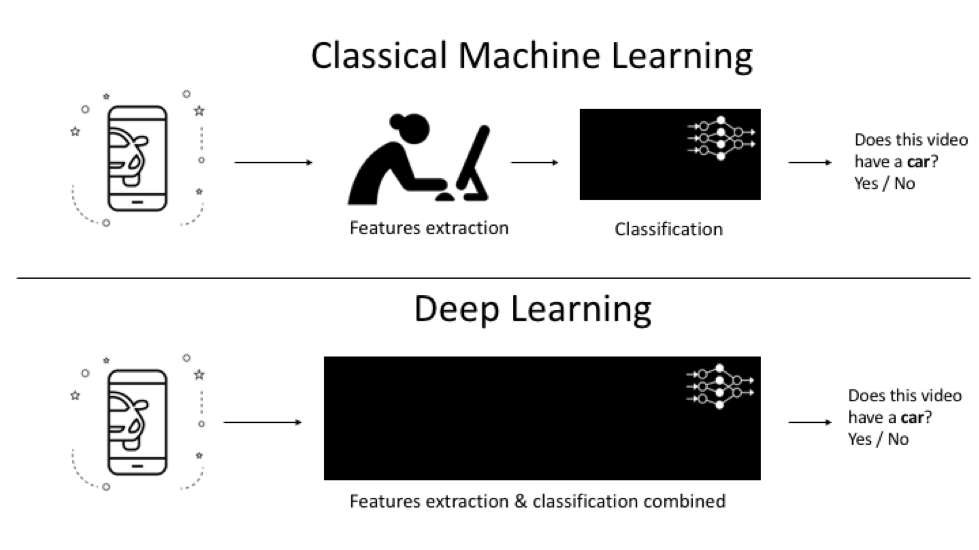
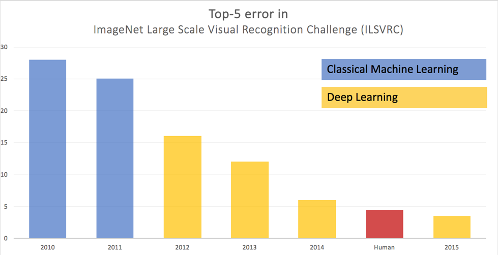

AI, Machine Learning, Deep Learning. Why should I care?
===========================================================================================================================

autor: Piotr Czapla

Artificial Intelligence (AI) is a research field focused on creating
solutions that can independently make decisions and draw humanlike
conclusions. If it scared you a little, you probably remembered movies
or fantasy books about robots taking over control of the world. No
wonder. Research and development of AI have been ongoing since the 50 of
the last century, with the computers' development. First thoughts in
mass culture about AI were a reflection of the fears that accompanied
the generations living in the shadow of the Cold War and arms races. But
what really is AI?

### Netflix and machine learning 

As you see, we seek AI for nearly 80 years. The only reason for recent
boom in media is the fact that we are getting closer; thanks to a subset
of Machine Learning that is called Deep Learning and Deep Reinforcement
Learning.

When we say \"Machine Learning\", we mean techniques that let computers
perform operations based on data or real world observations without
being explicitly programmed to. In essence it gives us a way to obtain
algorithms that can develop intuition to perform tasks based on a number
of examples. Let\'s say Netflix wants to build a recommendation system.
They can do it just by collecting examples of movies you like or not and
use this information to train a model that accurately predict whether
you are going to like the new movie they recommend. If you don't give
them enough ratings they still can predict how you like a movie based on
your behavior - what you watched yesterday, did you ever pause, did you
binge over particular series, did you watch the whole episode and many
other details.

Such process of extracting useful patterns from unstructured data (like
a stream of user interactions ) is called feature extraction and is the
fundamental task that humans had to do in classical Machine Learning. It
means that in case of Netflix the machine could not decide for
themselves which viewer's behaviors say the most about his involvement
in the film (or a lack thereof ). Distinguishing significant patterns of
actions (features) was a human job. 

### Deep Learning -- a few steps further 

With the advent of deep learning, feature extraction, a labor-intensive
task is successfully taken over by algorithms, what makes years of
research on machine learning - partially obsolete.  \
This had a great impact on the performance of our algorithms. Have a
look at the results from yearly image recognition challenge, where the
modern deep learning was reborn in 2012, here is the error rate of best
models the lower the better: 

Deep learning opened the door to yet uncovered parts of the Machine
Learning. Like Generative Adversary Networks ( GANs), where computers
are able to generate any images or transform faces in movies. Companies
seeking humanlike AI (AGI) use Deep Reinforcement Learning that let
computers reproduce a 300-year history of research on Go in over a
month, or create complex multi networks models interacting with Humans
over the phone to book you a hair dresser appointment.\
\
The fields in which you can apply deep-learning techniques are plenty.
It began with Computer Vision and now extends to machine translation,
natural language processing and natural language understanding, voice
recognition, speech synthesis, security, image (videos or photos)
generation and editing, medical diagnosis etc.

To navigate the hype-wave, knowledge and inspiration are in price. Here,
in Applied AI section of our blog, you will find recent and thrilling
examples of deep learning applications. Use them for your business
advantage.

Good Luck!

Tagged: [HR](tag/HR.html), [Healthcare](tag/Healthcare.html),
