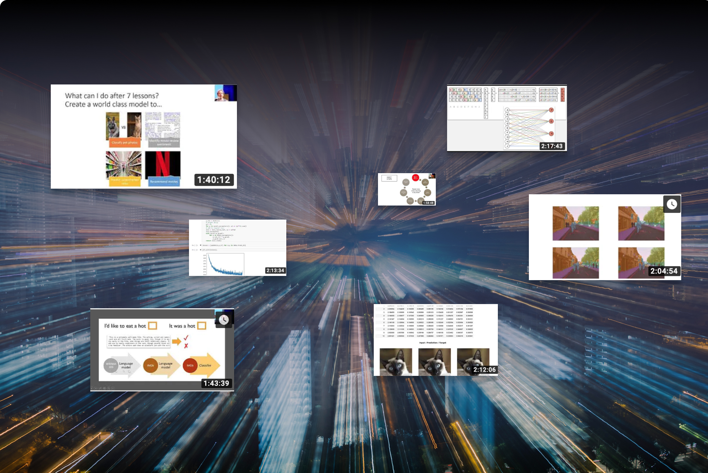

[Practical Deep Learning for Coders v3 is out!](practical-deep-learning-for-coders-v3-is-out.html)
==========================================================================================================

autor: Piotr Czapla

[date:long](practical-deep-learning-for-coders-v3-is-out.html)

The third edition of fast.ai's course: Deep Learning for Coders part 1
is now publicly released, and I can assure you it is a must watch for
anyone that is interested in AI.

I'm mesmerized with the mission of fast.ai to make the DeepLearning
"uncool" and omnipresent in the future. Their hard work makes it one of
the best ways to incorporate AI into your business at a fraction of the
cost. Think for a bit about this, you have:

-   A library that lets you create state of the art models in just a few
    lines of code. [[You can read more about the library on our previous
    blog post.]](fastai-v1.html)

-   A freely available online course consisting of 7 lessons, each \~2h
    long, that is designed to make your team instantly productive and
    engaged (and it truly delivers on that with the code-first
    approach),

-   You have a thriving community of motivated people that already
    learned quite a bit during the course about Deep Learning.
    (Currently, forums.fast.ai has 21k users)

Even if you're not planning on becoming an AI expert I encourage you to
just watch the videos to understand what is possible and how easy it is
to apply it to your own products. Moreover, since Google has included
fastai in their [[colab
notebooks]](https://twitter.com/jeremyphoward/status/1089128401368018945)
you can run your first experiments for free, in matters of minutes.

[[You can find out more about the course on Jeremy\'s
blog.]](https://www.fast.ai/2019/01/24/course-v3/)

Whether your business is just starting the deep learning adventure or
you need some advice on improving your models or deploying to
production, [[we are happy to
help]](contact-us/index.html).
Especially, if you're using fast.ai library.

