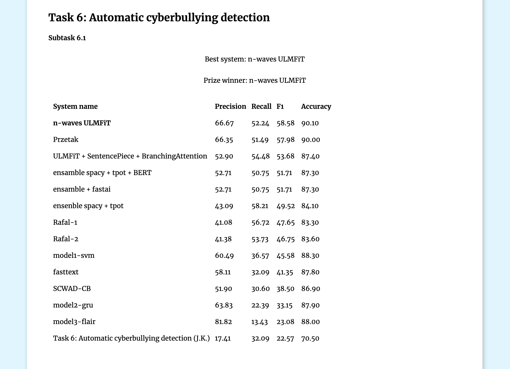

Poleval 2019 - another year another winning
========================================================================

autor: Piotr Czapla

Our submission to Poleval 2019 won 1st price in hate speech detection.
That will be the second time in the row! The competition was strong, and
congratulations to them. It is nice to see that simpler and faster
architecture like ULMFiT beat huge models like BERT.

<http://poleval.pl/results/>

